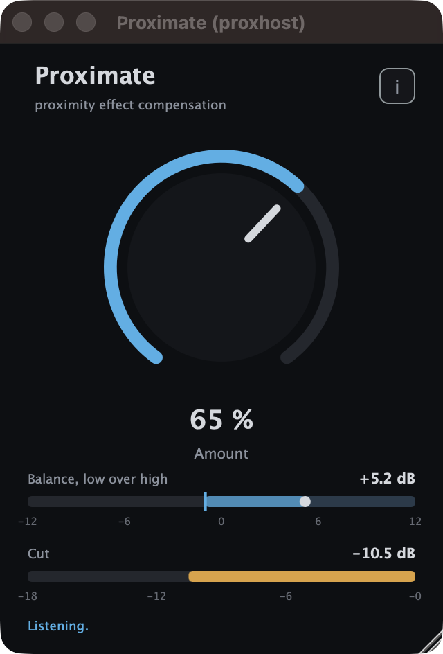

# Proximate user guide

Proximate is **one knob against the proximity effect**. Put it on a vocal or speech channel
and, when the talker leans into the microphone and the low end swells, it takes the swell
off again — a low shelf that deepens as they get closer and comes back off as they step
away, so the voice keeps the same tonal balance wherever the mic is. It never boosts, it
adds no latency, and it does not react to level, only to balance. VST3, Audio Unit and a
standalone app.

> **Before you rely on this:** the compensator is pinned by 85 unit checks — it never
> boosts at any frequency, amount 0 is bit-for-bit transparent, it holds still through
> pauses, the same signal 20 dB quieter gets the same cut, both channels of a stereo pair
> get the same filter — and the VST3 and AU pass `pluginval` at its strictest level and
> `auval` with a reported latency of 0. On synthesised speech run through a model of a
> cardioid at 4 cm, the plugin loaded as a host loads it produced the same output, sample
> for sample, as the bare compensator. It has **not** yet been used on a real microphone in
> a real room, and it has met few hosts. Check it in your own rig first.
>
> This codebase was created with AI assistance, directed and reviewed by a human author.

---

## The idea

Every directional microphone has a proximity effect: the closer the source, the more bass
it picks up. A handheld dynamic at a few centimetres reads something like +10 dB at 100 Hz
against the same voice at arm's length, tailing off through the low mids. On a presenter
who wanders towards and away from the mic, or a singer who works it, that is a tone that
keeps changing — boomy and chesty when they are close, thin when they step back — and a
static EQ can only be right at one distance.

Proximate does not know where the talker is. What it can measure is the **balance**
between the energy below 250 Hz and the energy above it. A voice at a steady distance
keeps that balance within a few dB of itself, phrase to phrase; a talker who leans in tips
it towards the low end by several dB, on top. So the plugin holds the balance at or under
a **ceiling**, and whatever the low band is over the ceiling by is taken off again with a
first-order low shelf — the same shape as the effect it is undoing, flattening at 120 Hz
and reaching further up the spectrum the deeper it goes, exactly as the boost does the
closer they get.

- **One knob.** Amount sets the ceiling, from "never" at 0 % to a deliberately thin balance
  at 100 %. Zero is off, bit for bit.
- **It never boosts.** The shelf only cuts. The output is the input with less low end, or
  the input untouched.
- **Zero latency.** No look-ahead, no buffering beyond the host's block. Safe to monitor
  through.
- **It reacts to balance, not level.** The detector is a ratio, so a talker who simply
  gets louder is left alone, and one who whispers close to the mic still gets corrected.
- **It holds through pauses.** When nobody is talking the cut stays where it is. A pause is
  not a change of distance, and the balance of the room's noise floor is not information.

*Synthesised speech run through a model of a cardioid microphone at 4 cm, at 65 %: the
balance reads +5.2 dB against a ceiling of −1 dB and the shelf is taking 10.5 dB off.*

---

## Installing

Take a release build from the [releases page](https://github.com/stoatworks-labs/proximate/releases),
or build it from source with CMake (see the README).

- **macOS** — the `.pkg` installs the VST3 to `/Library/Audio/Plug-Ins/VST3/`, the Audio
  Unit to `/Library/Audio/Plug-Ins/Components/` and the standalone to `/Applications`, with a
  checkbox for each. The `.dmg` carries the same three bundles for anyone who would rather
  drag them into `~/Library/Audio/Plug-Ins/`. The builds are Developer ID-signed and
  notarised, so there is no quarantine step.
- **Windows** — the installer drops the VST3 into `C:\Program Files\Common Files\VST3\`,
  which every host scans. The `.zip` is the same bundle plus the standalone without the
  installer. The Windows builds are unsigned — see [UNSIGNED.md](UNSIGNED.md) for the
  one-time SmartScreen click-through.
- **Linux** — the `.deb` and `.rpm` install the VST3 to `/usr/lib/vst3/`. The `.zip` holds
  the bundle and the standalone binary.

Then rescan plugins in your host. Proximate appears under **Stoatworks Labs**, as a mono or
a stereo effect.

---

## Setting it up on a channel

Insert it on the microphone channel, **after** the channel's high-pass filter and any
static EQ, and before the compressor. The order matters twice over: the static EQ sets the
tone at the talker's *normal* distance, and Proximate only has to deal with the change from
there; and a compressor placed before it would be driven by the boom Proximate is about to
take off.

1. **Start at 50 %** and have the talker speak at their normal distance. Watch the
   **Balance** meter: the dot is where the balance is, the line is the ceiling. At the right
   setting the dot sits under the line most of the time, touching it on the odd phrase.
   Nothing much should be happening on the **Cut** meter yet.
2. **Have them lean in.** The dot moves right past the line, the cut meter fills from the
   right, and the boom comes off. If it does not come off enough, turn the knob up; if the
   voice is thin at the normal distance, turn it down.
3. **Leave it.** There is nothing else to set. The speed it moves at, where it splits the
   band, how deep it will go — those are fixed, and they are described below so you know
   what to expect.

A voice with a lot of natural low end (a bass speaker on a large-diaphragm condenser) sits
higher on the balance meter and wants a lower knob setting; a high voice sits lower and wants
a higher one. There is no right number — the meter is there so the knob can be set by
looking rather than by guessing.

---

## The control

| Control | Default | What it does |
| --- | --- | --- |
| **Amount** | 50 % | Where the ceiling sits. 0 % is off, bit for bit. At 50 % the ceiling is at +2 dB; at 100 % it is at −8 dB. Linear in between: each 5 % is 1 dB of ceiling. Double-click returns it to 50 %. |

Everything else is tuning, fixed and documented:

| | | |
| --- | --- | --- |
| **Split** | 250 Hz | The detector's low band is everything under this, the high band everything over it. |
| **Shelf floor** | 120 Hz | Under this the cut is the full amount. The shelf's corner rises with depth: a 12 dB cut reads −10 dB at 100 Hz, −6 dB at 250 Hz, −2.6 dB at 500 Hz and −0.8 dB at 1 kHz — the inverse of a handheld dynamic's published proximity curve at a few centimetres, to within a dB. |
| **Ratio** | 2 dB per dB | How much shelf a dB of balance over the ceiling buys. The balance as the detector measures it moves by only a quarter to a third of the shelf's nominal depth, so 1:1 would be far too gentle. |
| **Knee** | 6 dB | Soft: the cut fades in from 3 dB under the ceiling to 3 dB over it, so an odd phrase that grazes the line is nudged rather than grabbed. |
| **Maximum cut** | 18 dB | However far over the ceiling the balance goes. |
| **Balance integration** | 200 ms | Long enough that the balance follows where the talker is standing rather than which vowel they are on. |
| **Attack / release** | 80 ms / 300 ms | How fast the cut deepens and comes off once the balance has moved. A talker who leans in is corrected within about half a second; the low end is back about half a second after they step away. |
| **Hold below** | −50 dBFS | Under this level in the high band nobody is talking, and the cut freezes where it is. |

### The meters

**Balance, low over high** is the detector's reading in dB, from −12 to +12: the energy
under 250 Hz relative to the energy above it. The vertical line is the ceiling the knob has
set, the dot is the balance right now, and the bar between them lights up when the balance
is over the ceiling — that lit part is what is being taken off. **Cut** is the shelf's
depth, filling from the right like a gain-reduction meter, with the number beside it. The
status line says **Listening** while the detector is live, **Holding** while nobody is
talking, and **Off** at 0 %.

---

## Stereo channels

On a stereo track the detector listens to the mean of the two channels and both get the
same shelf — a mono mic on a stereo insert behaves exactly as it would on a mono one, and a
stereo pair is not pulled apart.

---

## The standalone app

The standalone runs the plugin on an audio device, which is the quickest way to hear what it
does on a real microphone. Three things to know:

- **It opens no audio input on its first run.** Choose the microphone under **Options >
  Audio Settings**; the choice is remembered. (It starts output-only on purpose: opening an
  input and an output on two different devices makes the audio system combine them, and on
  a machine with several virtual audio devices installed that can stall before the window
  appears. A USB interface or an aggregate device, which has both, never has the problem.)
- **The input is muted until you say otherwise.** The yellow bar across the top says so;
  untick *Mute audio input* in the same settings dialog. Use headphones — a microphone into
  the speakers is a feedback loop with or without a plugin in it.
- On macOS it will ask for permission to use the microphone the first time.

---

## Troubleshooting

**Nothing happens.** The balance is under the ceiling: the dot never reaches the line. Turn
the knob up until leaning in pushes the dot past it. Or the level is under the hold
threshold — the status line says **Holding** — which means the plugin is not hearing enough
signal; check the gain before it.

**The voice is thin all the time.** The ceiling is under the talker's natural balance, so
the shelf is always in. Turn the knob down until the dot sits under the line at their normal
distance.

**It pumps on low notes.** A sung low note is more low end, and the detector cannot tell a
low note from a close mic — it only sees balance. The 200 ms integration and the soft knee
keep this small on speech; on a bass singer, turn it down until only the real leaning-in
crosses the line, and let the static EQ do the rest.

**It cuts plosives and handling noise.** It does: they are low end, and taking them off is
what a low shelf does. If that is unwelcome, a high-pass filter before Proximate is the
right tool for them.

**I want it to add low end when they step back.** It will not, by design. The static EQ
sets the tone at the normal distance; Proximate only ever removes what proximity adds.
